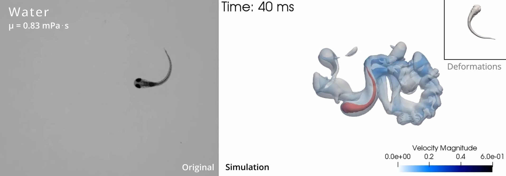

# Zebrafish 3D Reconstruction

Fortran90 code to reconstruct a 3D deforming zebrafish larva shape from segmented images of a zebrafish larva swimming after electrical stimulation.

This repository contains multiple Fortran90 files used to process segmented images of zebrafish larvae and reconstruct a deforming 3D shape from 2D and 3D data. Below is a brief description of each file included in this repository.

## Example of 3D reconstruction

For an example video: https://github.com/TheoMrc/zebrafish-3d-reconstruction/blob/main/Example.mp4

## Code authors
The main authors of the code are Guillaume Ravel, PhD (At the time PhD student in Mathematics and IT at INRIA (Bordeaux, France) and Rare diseases, genetics and metabolism (MRGM, INSERM U1211, Bordeaux, France) and Michel Bergmann, PhD (Senior researcher at INRIA, Bordeaux, France). Théo Mercé, PhD (Post-doctorate student in Biochemistry at Rare diseases, genetics and metabolism (MRGM, INSERM U1211, Bordeaux, France) cleaned the files, prepared the repository and optimized some of the scripts from the project for publication.

## Table of Contents
1. [Main Files](#main-files)
   - [main_2D_reconstruction.f90](#main_2d_reconstructionf90)
   - [main_3D_reconstruction.f90](#main_3d_reconstructionf90)
2. [Modules and Utilities](#modules-and-utilities)
   - [AdvectionProblem.f90](#advectionproblemf90)
   - [doubler.f90](#doublerf90)
   - [interpol.f90](#interpolf90)
   - [libBezier.f90](#libbezierf90)
   - [midline_2D_modules.f90](#midline_2d_modulesf90)
   - [TimeScheme.f90](#timeschemef90)
   - [variables.f90](#variablesf90)
   - [makefile](#makefile)
3. [Other Files](#other-files)
   - [2Dshape.dat](#2dshapedat)

## Main Files

### [main_2D_reconstruction.f90](./main_2D_reconstruction.f90)
- **Row Count:** 3003
- **Description:** 
  This is the optimized version of the 3D reconstruction code that pre-processed 2D fish shape, reducing memory consumption compared to the 3D version. The code reconstructs the 2D midline of the fish and recalculates points along the midline and the sides of a binarised shapes of a swimming zebrafish after procrusted analysis (see the [Zebrafish procrustes analysis](https://github.com/TheoMrc/zebrafish-procrustes-analysis) repository). This file is executed multiple times due to the iterative process of adjusting the extracted midline.

### [main_3D_reconstruction.f90](./main_3D_reconstruction.f90)
- **Row Count:** 4171
- **Description:** 
  This file contains the Fortran90 code for reconstructing the zebrafish shape in 3D. The algorithm processes 2D segmented images of a swimming zebrafish after procrustes analysis, extracts the midline and body surface points to afterwards generate a 3D shape of zebrafish larva that deforms over time, without translation or rotation rigid motions. This deforming 3D shape is then input in a Navier-Stokes equations solver (see [Bergmann et *al.*, 2014](10.4208/cicp.220313.111013a)). 

## Modules and Utilities

### [AdvectionProblem.f90](./AdvectionProblem.f90)
- **Row Count:** 2166
- **Description:** A module that handles advection-related problems in the 3D reconstruction process. Used as a dependency for the main reconstruction functions.

### [doubler.f90](./doubler.f90)
- **Row Count:** 8
- **Description:** A small utility module.

### [interpol.f90](./interpol.f90)
- **Row Count:** 83
- **Description:** A module used for interpolation functions required in the reconstruction process.

### [libBezier.f90](./libBezier.f90)
- **Row Count:** 2759
- **Description:** A module implementing Bézier curve functionality, for various smoothingand  transformations during the zebrafish shape reconstruction.

### [midline_2D_modules.f90](./midline_2D_modules.f90)
- **Row Count:** 105
- **Description:** A collection of utility functions specifically designed to help with the extraction and manipulation of the zebrafish midline in the 2D reconstruction process, like the pre-processing of the 3D shape to a 2D shape for use in the main 2D reconstruction file, and some file saving utils.

### [TimeScheme.f90](./TimeScheme.f90)
- **Row Count:** 181
- **Description:** A module used to manage the time-stepping scheme during the simulation and reconstruction process.

### [variables.f90](./variables.f90)
- **Row Count:** 13
- **Description:** A small module defining variables used throughout the reconstruction code. This contains global parameters and constants that are shared among different modules.

### [makefile](./makefile)
- **Description:** This file defines the compilation process for the project. It specifies how each of the `.f90` files should be compiled and linked to generate the executable files required for the reconstruction. It includes the dependencies necessary for each file to ensure proper compilation order.

## Other Files

### [2Dshape.dat](./2Dshape.dat)
- **File Size:** 13 MB
- **Description:** This file contains the 2D shape of the zebrafish after flattening its 3D shape. It is used during the 2D reconstruction process.

